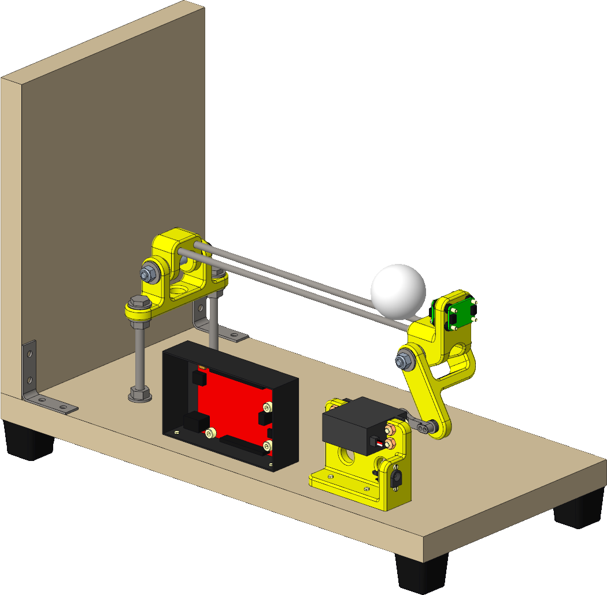
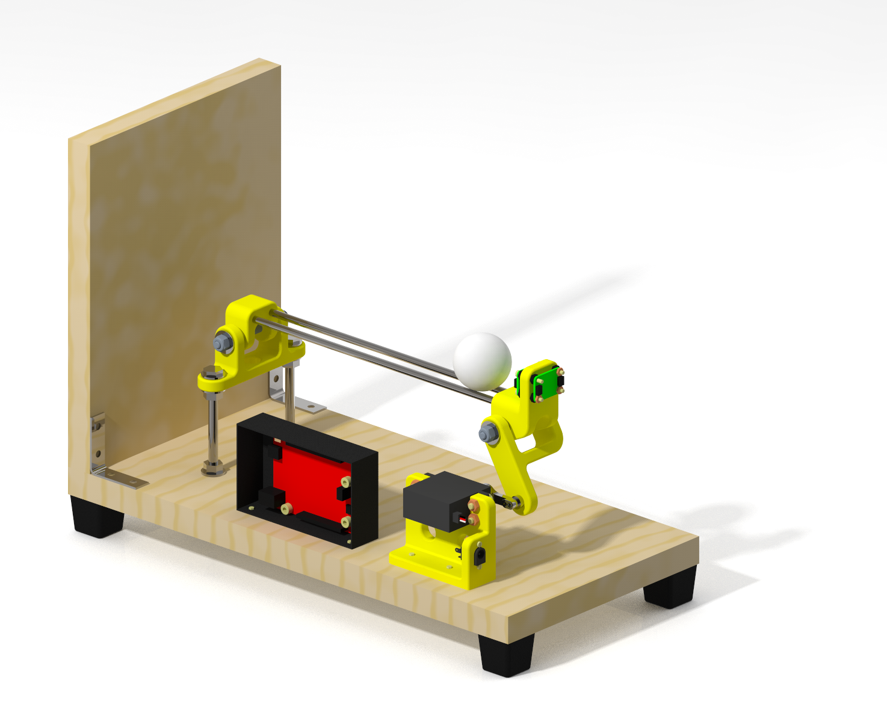

</img>

# OBB: Open Ball & Beam

## Why OBB?
OBB is *control science for everyone*.

Existing educational control systems are often 
1. Prohibitively expensive (cost thousands of USD)
2. Use proprietary hardware and software
   - Development knowledge is not transferrable to other systems

OBB offers a viable alternative 
1. OBB is cheap enough for most individuals and labs
2. OBB uses open-source and widely available hardware and software

## Hardware Construction
See [`parts_list.xlsx`](hardware/parts_list.xlsx) for a list of parts to purchase and to kit out a single OBB unit.

See the build guide TODO for instructions on how to assemble an OBB unit.

</img>
&nbsp; &nbsp; &nbsp; &nbsp;
</img>

## Dependencies

### Arduino
- [Arduino IDE](https://www.arduino.cc/en/software)
- [Servo library](https://www.arduino.cc/reference/en/libraries/servo/)
- [Polulu VL53L0X library](https://github.com/pololu/vl53l0x-arduino)
- [Adafruit_LSM6DS](https://github.com/adafruit/Adafruit_LSM6DS)
- [BasicLinearAlgebra](https://www.arduino.cc/reference/en/libraries/basiclinearalgebra/)

1. Install the [Arduino IDE](https://www.arduino.cc/en/software)
2. Install the following libraries from the `Manage Libraries...` dialog in the Arduino IDE
    - [Servo](https://www.arduino.cc/reference/en/libraries/servo/) (may be installed already with the Arduino IDE)
    - [Polulu VL53L0X](https://github.com/pololu/vl53l0x-arduino)
        - Search for `VL53L0X`
        - Be sure to use the Polulu library and NOT the Adafruit Library (regardless of whether the Polulu or the Adafruit physical hardware is used)
    - [Adafruit_LSM6DS](https://github.com/adafruit/Adafruit_LSM6DS)
        - Search for `Adafruit LSM6DS`
        - Select `Install All` if prompted
    - [BasicLinearAlgebra](https://www.arduino.cc/reference/en/libraries/basiclinearalgebra/)
        - Search for `BasicLinearAlgebra`

### Python
- [NumPy](https://numpy.org/)
- [SciPy](https://scipy.org/)
- [Matplotlib](https://matplotlib.org/)
- [PyQtGraph](https://www.pyqtgraph.org/)
- [PySerial](https://pythonhosted.org/pyserial/)
- [Keyboard](https://pypi.org/project/keyboard/)
- [ruamel.yaml](https://yaml.readthedocs.io/en/latest/)
- [OSQP](https://osqp.org/)

Install the dependency packages with the following Conda commands
- `conda install numpy scipy matplotlib pyserial keyboard ruamel.yaml`
- `conda install -c conda-forge pyqtgraph osqp`

## Installation

### Arduino

A baud rate of 115200 is used throughout the project.
- When using `Tools` -> `Serial Monitor` or `Serial Plotter` make sure to use 115200 baud rate.

### Python
It is recommended to use Anaconda or virtualenv to create a separate environment to install in.

1. Activate the desired environment
2. Open a terminal / command prompt / Anaconda Prompt
3. Navigate to the root level directory of this package
4. Run the command `pip install .`

## Setup
1. COM port
    - Determine the COM port that your Arduino is attached to
        - e.g. use Device Manager in Windows
    - In [`hardware_configurator.py`](ballbeam/configurators/hardware_configurator.py) change `PORT` to `COM#` as appropriate.
2. Servo and sensor calibration coefficients
    - Run [`servo_calibrator.py`](ballbeam/calibrators/servo_calibrator.py) and [`sensor_calibrator.py`](ballbeam/calibrators/sensor_calibrator.py)
    - Copy the printed coefficients into [`constants.cpp`](ballbeam/arduino/interface/src/constants.cpp)

## Usage

There are two APIs that offer comparable functionality: Python and Arduino.

### Arduino API
In the Arduino API, all processing (e.g. control and state estimation) occurs locally on the Arduino board. No serial connection to a host computer is strictly required during system operation; a serial connection is required only for uploading programs and for monitoring system operation through the Serial Monitor and Serial Plotter.

The benefit of the Arduino API is that no host computer is required to run the system. 
In this configuration, only power to the Arduino (e.g. over the USB cable) is necessary, so the system is more portable and be run from any location with power outlets.
MPC control is currently not available in the Arduino API.

#### Arduino
1. Upload [`interface.ino`](ballbeam/arduino/interface/interface.ino) to the Arduino.
2. Start the `Tools` -> `Serial Plotter` to monitor the various signals in the system.

### Python API
In the Python API, the majority of processing occurs on the host computer and the Arduino acts as a simple client, sending raw measurement information and receiving actuator commands. A stable serial connection is required throughout system operation to maintain stability.

The benefit of the Python API is that the full computing power of the host computer can be used to control the system.
In particular, the more computationally intensive Model Predictive Control (MPC) strategy can be used.

#### Arduino
1. Upload [`client.ino`](ballbeam/arduino/interface/client.ino) to the Arduino.

#### Host computer 

1. Adjust all the configurable parameters in the [`*\_configurator.py`](ballbeam/configurators) files as needed
     - Set the `system_type` variable to `'Simulator'` in [`interface_configurator.py`](ballbeam/configurators/interface_configurator.py) first to ensure proper functioning in the simulator before attempting to run on the physical hardware
3. Run [`configurators.py`](ballbeam/configurators/configurators.py) to run all configurators
4. Run [`interface.py`](ballbeam/common/interface.py) to start the interface (without running configurators)

Alternatively, run [`main.py`](ballbeam/main.py) to run the configurators as well as start the interface.

# Alternative Ball & Beam Systems

## Quanser Ball and Beam
- Commercial product available from https://www.quanser.com/products/ball-and-beam/
- Price not publicly available, but indications are that the cost runs in the several thousand dollar range https://ftp.esat.kuleuven.be/stadius/barrero/cacsd/www%20and%20mails/EDU_Pricing.pdf
- Proprietary control software, tethered to a company for support and under-the-hood knowledge.

## BOBShield
Recently BOBShield was proposed
https://ieeexplore.ieee.org/abstract/document/9454013

Similarities between BOBShield and OBB:
- Arduino-based
- Open-source
- Time-of-flight sensor

Benefits of BOBShield over OBB:
- Smaller
- Lower cost
- Lower part count
- Ball cannot fall off

Drawbacks of BOBShield under OBB:
- Tube/beam length is very small
  - Limited operational range
  - Harder to visualize large excursions
- Servo is directly attached to the beam
  - Beam angle to servo angle ratio is 1:1, which results in a lack of precision
  - Beam angle only needs to be +/- 5 degrees in typical operation, while servo can easily do +/- 90 degrees
  - Servo cannot rotate through its full range without collision
    - By contrast, OBB the servo can rotate 360 degrees without issue 
    - Good during troubleshooting in case servo is accidentally commanded/activated to large angles
- Servo is driven by Arduino power rather than an external power source
  - BOBShield can get away with this because they use a micro servo, but not ideal for reliable power delivery
- Ball is captured inside a transparent tube
  - Can lead to unusual friction behavior (harder to control)
  - ToF sensor not able to function properly due to occlusions (harder to sense)
- No IMU sensor
  - Cannot automatically calibrate servo angle against Earth's gravity
