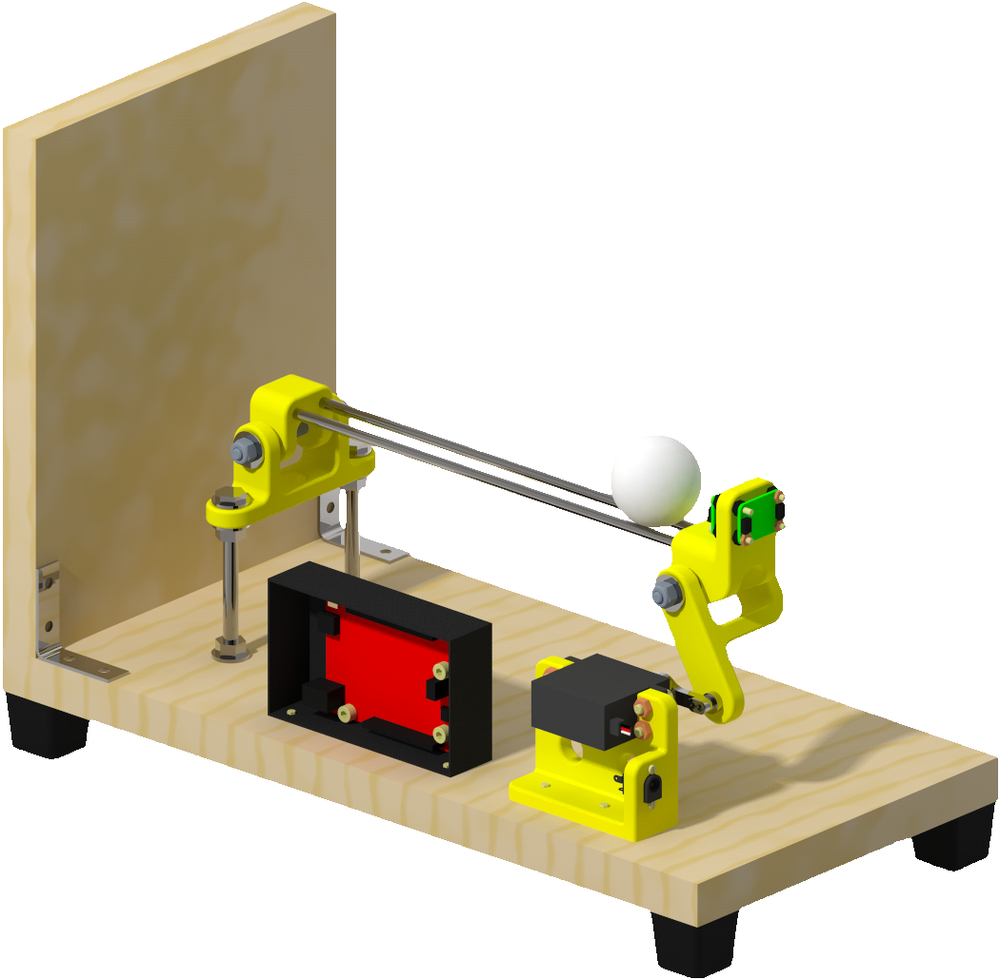
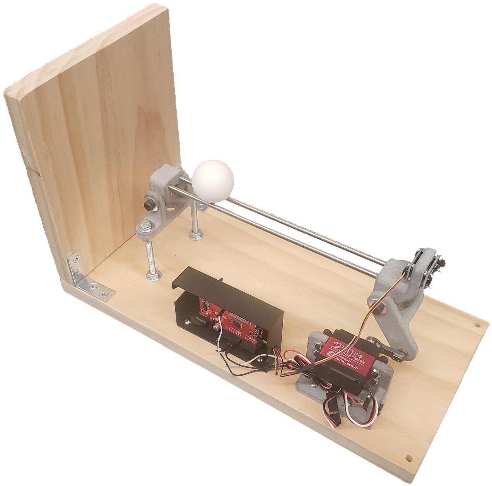

<div align="center">
</img>
</div>

# OBB: Open Ball & Beam

[**Hardware**](#hardware)
| [**Software**](#software)
| [**Mathematics**](#mathematics)
| [**Contributors**](#contributors)

## What is OBB?

OBB is *control science for everyone*.

1. A low-cost, open-source hardware and software platform.
2. For research, teaching, and self-guided instruction in data-driven control.
3. An open-loop neutrally stable dynamical system that is nontrivial to control.

## Why OBB?

[Existing educational control systems](docs/ALTERNATIVES.md) are often

1. Prohibitively expensive (cost thousands of USD)
2. Use proprietary hardware and software
   - Development knowledge is not transferrable to other systems.

OBB offers a viable alternative

1. OBB is cheap enough for most individuals and labs.
2. OBB uses open-source and widely available hardware and software.

OBB encourages users to get their hands dirty!

1. Redesign custom 3D parts
2. Create new & improved controllers
3. Try out reinforcement learning algorithms

# Hardware

## Parts list

See [`parts_list.xlsx`](hardware/parts_list.xlsx) for a list of parts to purchase and to kit out a single OBB unit.

## CAD models

CAD models for 3D printing are provided in the [`cad`](hardware/cad) directory.

- [STEP files](hardware/cad/step) (portable format), suitable for 3D printing.
- [PTC Creo files](hardware/cad/creo) (native format), suitable for viewing and redesign in PTC Creo.
  - The full assembly [`ballbeam.asm`](hardware/cad/creo/ballbeam.asm) may be opened in Creo. Working kinematic joints are provided so the movement can be interacted with via dragging.

## Assembly and setup

See the [Assembly and Setup Guide](docs/OBB_Assembly_and_Setup_Guide/OBB_Assembly_and_Setup_Guide.pdf) for instructions on how to assemble an OBB unit.

<div align="center">
</img>
&nbsp; &nbsp; &nbsp; &nbsp;
</img>
&nbsp; &nbsp; &nbsp; &nbsp;
</img>
</div>

# Software

## Development info

OBB was developed and tested on 64-bit Windows 10 using Anaconda environments, but should work on other platforms as well e.g. macOS & Linux.

## Features

OBB ships with the following software features.

### Control schemes

- Proportional-integral-derivative (PID)
- Linear quadratic regulator (LQR) with integral control
- Model predictive control (MPC) with integral control
- Anti-windup for integral control

### Observation processing schemes

- Exponential smoothing
- Linear quadratic state estimation (Kalman filter)

### Convenience features

- Ball removal detection

### OpenAI Gym environments

OBB ships with environments compatible with [OpenAI Gym](https://gym.openai.com/) (requires Gym installation)

- Continuous action-space environment `BallBeamContinuousEnv`
- Discrete action-space environment `BallBeamDiscreteEnv`
- Option to use simulator (with fast visualizer) or the actual physical hardware

Try out reinforcement learning algorithms e.g. those from [OpenAI Spinning Up](https://spinningup.openai.com/en/latest/) in simulation or on a real-world physical system!

## Setup

### Arduino

#### Dependencies

- [Arduino IDE](https://www.arduino.cc/en/software)
- [Servo library](https://www.arduino.cc/reference/en/libraries/servo/)
- [Polulu VL53L0X library](https://github.com/pololu/vl53l0x-arduino)
- [Adafruit_LSM6DS](https://github.com/adafruit/Adafruit_LSM6DS)
- [BasicLinearAlgebra](https://www.arduino.cc/reference/en/libraries/basiclinearalgebra/)

1. Install the [Arduino IDE](https://www.arduino.cc/en/software)
2. Install the following libraries from the `Manage Libraries...` dialog in the Arduino IDE
    - [Servo](https://www.arduino.cc/reference/en/libraries/servo/) (may be installed already with the Arduino IDE)
    - [Polulu VL53L0X](https://github.com/pololu/vl53l0x-arduino)
        - Search for `VL53L0X`
        - Be sure to use the Polulu library and NOT the Adafruit Library (regardless of whether the Polulu or the Adafruit physical hardware is used)
    - [Adafruit_LSM6DS](https://github.com/adafruit/Adafruit_LSM6DS)
        - Search for `Adafruit LSM6DS`
        - Select `Install All` if prompted
    - [BasicLinearAlgebra](https://www.arduino.cc/reference/en/libraries/basiclinearalgebra/)
        - Search for `BasicLinearAlgebra`

### Python

It is recommended to use [virtualenv](https://docs.python.org/3/library/venv.html) to create a separate environment to install OBB and its dependencies.

1. Open a terminal / command prompt
2. Create a new environment
3. Activate the desired environment
4. Install the dependency packages
    - ```pip install -r requirements.txt```

#### OBB Installation

1. Navigate to the root level directory of this package.
2. Run the command `pip install -e .`
    - NOTE: The `-e` option is very important! This is what tells pip to install in "editable mode", so that changes you make to scripts actually take effect when you run them! Read the [official pip docs](https://pip.pypa.io/en/stable/topics/local-project-installs/#editable-installs) for more details.

#### Development

##### Pre-commit

Run

```bash
pre-commit run --all-files
```

to run all pre-commit hooks, including style formatting and unit tests.

##### Package management

Update [`requirements.in`](requirements.in) with new direct dependencies.

Then run

```bash
pip-compile requirements.in
```

to update the [`requirements.txt`](requirements.txt) file with all indirect and transitive dependencies.

Then run

```bash
pip install -r requirements.txt
```

to update your virtual environment with the packages.

### General setup (cross-platform Arduino <--> Python)

1. Baud rate
    - A baud rate of 115200 is used throughout the project.
    - When using `Tools` -> `Serial Monitor` or `Serial Plotter` make sure to use 115200 baud rate.

2. COM port
    - Determine the COM port that your Arduino is attached to
        - e.g. use Device Manager in Windows
    - In [`hardware_configurator.py`](ballbeam/configurators/hardware_configurator.py) change `PORT` to `COM#` as appropriate.

3. Servo and sensor calibration coefficients
    - Run [`servo_calibrator.py`](ballbeam/calibrators/servo_calibrator.py) and [`sensor_calibrator.py`](ballbeam/calibrators/sensor_calibrator.py)
    - Copy the printed coefficients into [`constants.cpp`](ballbeam/arduino/interface/src/constants.cpp)

## APIs

There are two APIs that offer comparable functionality:

1. [**Arduino API**](#arduino-api)
2. [**Python API**](#python-api)

### Arduino API

In the Arduino API, all processing (e.g. control and state estimation) occurs locally on the Arduino board. No serial connection to a host computer is strictly required during system operation; a serial connection is required only for uploading programs and for monitoring system operation through the Serial Monitor and Serial Plotter.

The benefit of the Arduino API is that no host computer is required to run the system.
In this configuration, only power to the Arduino (e.g. over the USB cable) is necessary, so the system is more portable and be run from any location with power outlets.
MPC control is currently not available in the Arduino API.

#### Usage

##### Arduino

1. Upload [`interface.ino`](ballbeam/arduino/interface/interface.ino) to the Arduino.
2. Start the `Tools` -> `Serial Plotter` to monitor the various signals in the system.

### Python API

In the Python API, the majority of processing occurs on the host computer and the Arduino acts as a simple client, sending raw measurement information and receiving actuator commands. A stable serial connection is required throughout system operation to maintain stability.

The benefit of the Python API is that the full computing power of the host computer can be used to control the system.
In particular, the more computationally intensive MPC strategy can be used.

#### Usage

##### Arduino

1. Upload [`client.ino`](ballbeam/arduino/interface/client.ino) to the Arduino.

##### Host computer

1. Adjust all the configurable parameters in the [`*_configurator.py`](ballbeam/configurators) files as needed.
     - Set the `system_type` variable to `'Simulator'` in [`interface_configurator.py`](ballbeam/configurators/interface_configurator.py) first to ensure proper functioning in the simulator before attempting to run on the physical hardware.
3. Run [`configurators.py`](ballbeam/configurators/configurators.py) to run all configurators.
4. Run [`interface.py`](ballbeam/common/interface.py) to start the interface (without running configurators).

Alternatively, run [`main.py`](ballbeam/main.py) to run the configurators as well as start the interface.

## Mathematics

An technical write-up describing the [mathematics](docs/OBB_Mathematics/OBB_Mathematics.pdf) behind the software is available.
Note that this document is still in development.

# Contributors

- Original author: [Benjamin Gravell](https://github.com/BenGravell)
- Testing and improvements: [Sleiman Safaoui](https://github.com/The-SS) and [Karthik Ganapathy](https://github.com/Klickeazy)
